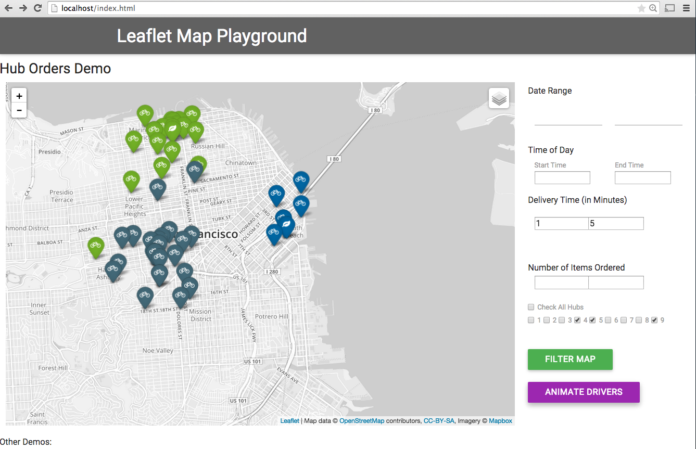

# Leaflet Map Playground

This repository is a web application written to explore in depth the map capabilities of the library Leaflet.js.
I've hosted the files at http://www.mailanreiser.com/leafletjs/

The Jasmine unit tests on the utility functions can be found at
http://www.mailanreiser.com/leafletjs/test/jasmine/

## Guide

By cloning this repo, you will delve into:
* Leaflet.js
* geoJSON - a format for encoding a variety of geographic data structures
* Plugins like Animated Markers and Awesome Markers!
* Jasmine Unit Testing
* Integration with RequireJS
* Materialize CSS Framework and JS (like the beautiful Datepicker)
* TimePicker

1. Clone this repository

  ```bash
  $ git clone git@github.com:iammai/leaflet-map-playground.git
  ```
2. To run the Hub Orders Demo: point your webhost to the leaflet-map-playround folder
   * leaflet-map-playground/index.html should load up all your dependencies (you can use a CDN for some of the script and css links but I've kept them local for now)

3. To run Jasmine unit tests, point your bower to http://localhost/test/jasmine (where localhost should be replaced by your webserver IP address)

4. To see other demos that are available by Leaflet.js and animated-markers: go to iammai/leaflet-map-playground/example-demo or click on one of the links from index.html

You should bee a similar view on your own browser:




## Thoughts on LeafletJS and application logic

I wanted to explore LeafletJS without the hassle of integrating it in a familiar framework like Backbone, Angular, Ember.
However, due to the flexible nature of the library, I believe one could easily integrated into any of them.


Stating out with Leaflet:
If you go to Leaflet's Basic Tutorial you can easily see the simple process of creating a map.
(see leaflet-map-playground/example-demos/leaflet-basic.html)
Once can draw shapes on the maps and also set icons on points on the maps. These are named "markers".
The markers can have other objects binded to them. Such as a popup.
The markers can be customized to any image you want, as you see from the branches.
This is when I started the investigation and found awesome-markers! Instead of png images, you can use vector fonts like font-aewsome to give you almost unlimited customizable icons! (font-awesome currently has 519!)
If we go back to my hubs order app, You'll see that I've used the awesome-marker with a leaf for the hub markers and drawn a small circle for the orders.

How do we get the data into the map?
If you have CSV files, it can be easily converted with the csv2geoJSON npm module.

The application takes 2 geoJSON files
* Hub file, which is a list of all the hubs and their latitude - longitude coordinates (leaflet-map-playground/app/data/hubs.geojson)
* Orders file, which is a list of where orders are place in the city of San Francisco, along with many attributes of the orders (leaflet-map-playground/app/data/orders.geojson)

The location of the files are stored in a config.js file (leaflet-map-playground/config.js)
config.js is a good place to store environment specific data as we could easily change the variable to an api endpoint later on for other environments.

app.js
App.js is where everything in the application is initialized.
First, we load in the 2 geojson files with a $.getJSON call.
When the data is done loading, we initialize our LeafMap object.

We will create a map of San Francisco. First we’ll initialize the LeafMap's map
* This it to our chosen geographical coordinates and a zoom level
* The init function will call addTileLayers

addTileLayers is a function in the LeafMap object that adds tiles and layers to our maps
* the tiles: make the map look pretty and with the map's control option, we can set the map to be able to toggle between grayscale and colored street view
* the layers
    * When we initialized our LeafMap, we also passed in our hub geoJson and ordersJson data to the object
    * to avoid multiple sorting, we will sort the information ONCE store it in the map's local variable that can be recalled later
        * Instead of one large orders geoJSON variable, we sort the points in the orders by hubs
        * If you look at the control module, you'll be able add and remove the hubs with their associated orders, this information is stored for easy filtering later

After our App is initialize, we bind some events to our document
* When 'Filter Map' button is clicked, we bind the event to a function that draws our filtered orders markers.
    * We want consider list of rules set by the user
        * Date Range
        * Time of Day Range
        * Delivery Time (in Minutes) Range
        * Number of Items Ordered Range
    * The user can enter as many or as few input fields are they want.
    * Before we draw new layers on our map, we want to remove the previous layers on our map (if any)
    * call LeafMap's addFilteredMarkers function:
        * We loop through our sorted orders and only go through hubs that are checked in the filter (this filter param will cut out a lot of data to process since we've sectioned it in the object)
            * We add the selected hub marker to the hub layer
        * For each order in our sorted sectioned order, we check it against the filter rules by comparing its properties and see if they match
            * If all the rule constraints are met, we add the order marker to the order layers
* When 'Animate Drivers' button is clicked, we want to draw our animated drivers markers
    * The list of rules set by the user are still considered
    * Before we draw new layers on our map, we want to remove the previous layers on our map (if any)
    * call LeafMap's animateDriverMarkers function:
      * We loop through our sorted orders and only go through hubs that are checked in the filter (this filter param will cut out a lot of data to process since we've sectioned it in the object)
      * We add the selected hub marker to the hub layer
      * For each order in our sorted sectioned order, we check it against the filter rules by comparing its properties and see if they match
            * If all the rule constraints are met, we add the ordered marker to the driver's route
            * Each driver's route is a linear polyline that consists of a list of lat-long points that the driver went to over time
            *  We animate each driver's route:
                * How this is achieved:
                    * each marker in the route is animated with css transitions (if available) and javascript with the animated-markers plugin
                    * because we have all the points in line, we can show the marker at different points in the line to achieve the effect of movement


* Here are some LeafMap  functions that are called repeatedly:

        *   removeLayers() - remove all layers from the map (hub layers, orders layers, animated layers)
            * each layer contains the corresponding markers
            * by organizing our markers to layers, we can easily remove and delete the markers in the layers (instead of keeping track of each marker)

        *   addHubMarkers() - add hub markers to the map
        *   addOrderMarkers() - add order markers to the map


* Jasmine Suite was Added to test some of our basic utility functions helper we used in the application
To run simply go to : http://mailanreiser.com/leafletjs/test/jasmine

## Contributing

1. Fork it!
2. Create your feature branch: `git checkout -b my-new-feature`
3. Commit your changes: `git commit -m 'Add some feature'`
4. Push to the branch: `git push origin my-new-feature`
5. Submit a pull request

## History

Leaflet.js is a powerful library that lets you easily create and manipulate maps. The documentation on the website is unparalleled.
I had never played with the library prior to this, but I believe it's very easily integrated into any current frameworks
and has amazing plugins (such as awesome-animations and awesome-markers!).

## Credits
Influenced and inspired by

* Leaflet.js - http://leafletjs.com/
* Animated Markers - https://github.com/openplans/Leaflet.AnimatedMarker
* Awesome Markers - https://github.com/lvoogdt/Leaflet.awesome-markers
* Font Awesome - http://fortawesome.github.io/Font-Awesome/icons/
* Jasmine Unit Tests - http://jasmine.github.io/
* Time Picker for jQuery - http://jonthornton.github.io/jquery-timepicker/
* csv2geoJSON npm module - https://github.com/mapbox/csv2geojson
